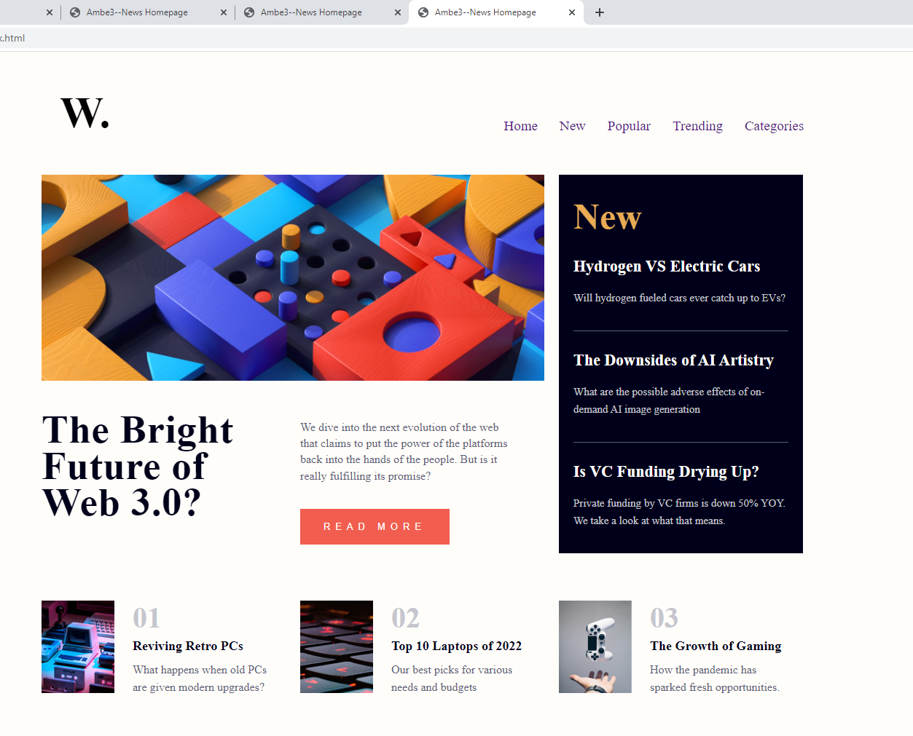

# Frontend Mentor - News homepage solution

This is a solution to the [News homepage challenge on Frontend Mentor](https://www.frontendmentor.io/challenges/news-homepage-H6SWTa1MFl). Frontend Mentor challenges help you improve your coding skills by building realistic projects. 

## Table of contents

  - [Screenshot]
  - [Built with]
  - [What I learned]
  - [Author]

### Screenshot

.png)
.png)
.png)

### Built with

- Semantic HTML5 markup
- CSS custom properties
- Flexbox
- CSS Grid

### What I learned

- Use media queries to build responsive pages for the widths 1440px(desktop) and 375px(mobile)
- Build a News Hompage
- How to use CSS grid and CSS flexbox to arrange page contents

## Author

- Website - [Ambe Mbong-Nwi Nchang](https://github.com/Ambe-Mbong-Nwi/Front-end_Web_Designs)
- Frontend Mentor - [Ambe-Mbong-Nwi](https://www.frontendmentor.io/profile/Ambe-Mbong-Nwi)